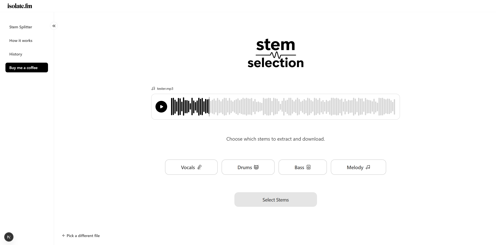

# isolate

The simplest stem splitter on the internet. Upload a track, pick your stems (vocals, drums, bass, melody), download. That's the whole app.

**Live demo:** [tryisolate.xyz](https://tryisolate.xyz/)



## What it does

Drop in an MP3, WAV, or FLAC file (up to 50 MB, 7 minutes). Pick which stems you want extracted, and isolate runs your audio through the Demucs model on Replicate to give you clean, separated tracks ready to download.

## Why I built it

As a music producer, I got tired of stem splitters that make you work for it: ads everywhere, sign-up walls, settings you shouldn't need to understand. So I built the easiest, most beginner-friendly stem splitter out there. No upsell, no sign-up wall, no paywall, no bloat. If you can drag a file, you can use isolate. One job, done at the highest quality.

## Tech stack

- **Next.js 16** with the App Router and Route Handlers
- **TypeScript** for type safety across the stack
- **Tailwind CSS** for styling
- **Zod** for runtime validation on the server
- **Replicate API** for the Demucs audio separation model
- **Vercel** for deployment

## Features

- Drag and drop or click-to-upload audio files
- Client-side validation for instant feedback (file type, size, duration)
- Server-side Zod validation as the security boundary
- Custom toast notifications for error messages
- Audio preview player before processing
- Selective stem extraction (pick only what you need)
- IP-based rate limiting to protect API budget
- Requests automatically cancelled if you navigate away
- Responsive design that works on mobile and desktop

## What I learned

This project taught me the difference between "it works" and "it's production-ready":

- **TypeScript is not enough.** It checks types at build time but disappears at runtime. Zod fills that gap by validating real data from real users.
- **Client and server validation serve different purposes.** Client is for UX, server is for security. You need both.
- **Middleware is not a security boundary.** Auth and validation belong inside route handlers, not in middleware that can be bypassed.
- **Environment variables behave differently at build time vs runtime.** Moving checks inside request handlers prevents build failures while still catching misconfiguration.
- **Memory cleanup matters.** Creating object URLs without revoking them leaks memory in long-running sessions.

## Running locally

```bash
git clone https://github.com/alex-monro/isolate.git
cd isolate
npm install
```

Create a `.env.local` file with your Replicate API token:

```
REPLICATE_API_TOKEN=your_token_here
```

Then start the dev server:

```bash
npm run dev
```

Open [localhost:3000](http://localhost:3000) in your browser.

## Project structure

```
app/
  api/process/       Route handler for the Replicate API call
  how-it-works/      Static info page
  page.tsx           Main upload and processing UI
components/          Reusable UI components (UploadZone, StemSelector, etc.)
lib/
  validation.ts      Zod schemas for server-side validation
```

## What's next

Splitting stays free and anonymous. Accounts will only ever exist so you can keep your stems.

- User accounts and a persistent library of past splits
- Background job processing for longer files
- Semantic search: find any stem in your library by describing the sound
- Waveform visualization during playback
